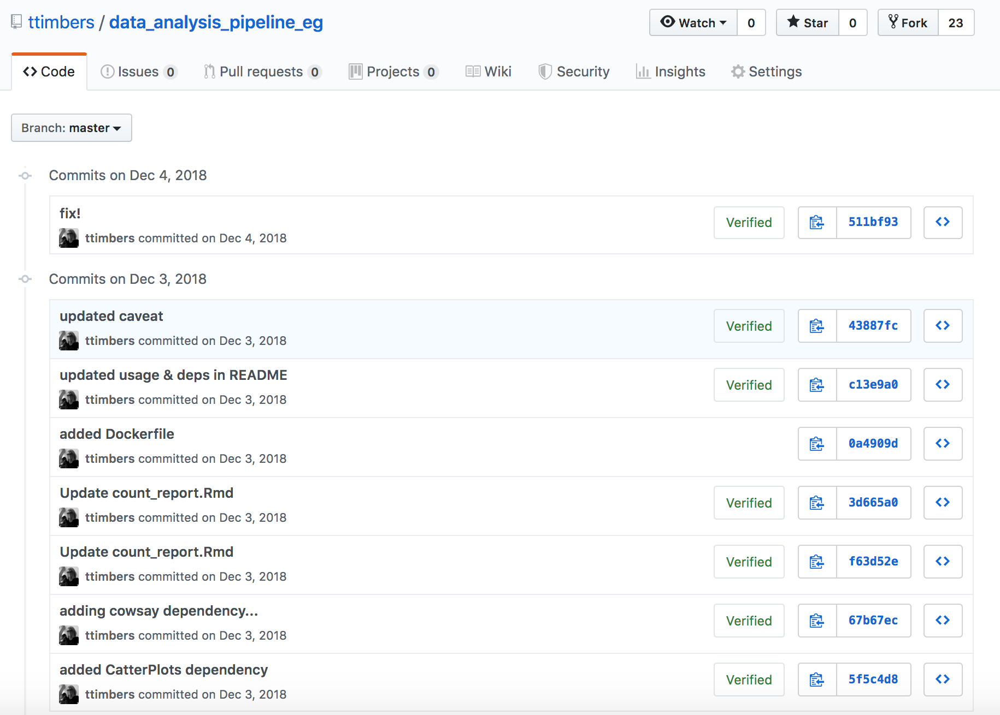
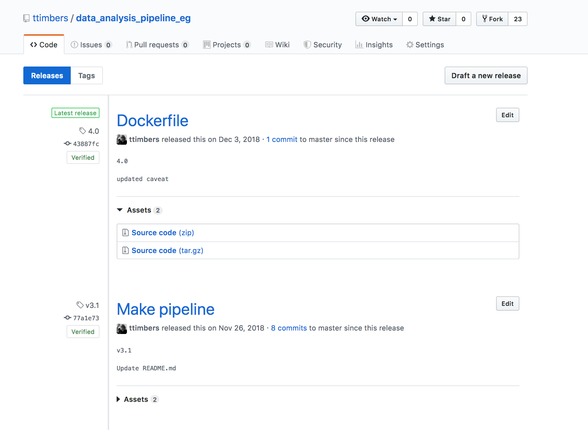

class: inverse, middle, center
## *and...*

# Data Science workflows that democratize complex projects

---

# What are complex projects?

I define complex projects as one that has __*at least one*__ of the following:

--

- two, or more, people directly working on the analysis

--

- projects that involve two or more coding documents

--

- projects that involve analysis of medium/large data 

--

- projects where you are working on a remote machine

--

- projects that have many software or environment dependencies, or ones that are difficult or take a long time to install

--

*As a project accumulates more of these features it grows further in complexity.*
---
class: center
## Complex projects without intentional Data Science workflows...


-- *Relativity by Maurits Cornelis Escher*
---

# Concrete examples of problems that can occur in complex analyses

--

- An interesting result that you cannot recreate 😞

--

- Your email inbox is full of information related to the project that only you have access too 😫

--

- A small change to the analysis code requires re-running the entire thing, *and takes hours...* 😧

--

- Activation time to becoming productive after taking a break from the project is hours to days 😴

--

- Code that can only be run on one machine, *and you don't know why...* 😵

---
class: inverse, middle, center
# How can we avoid such problems and chaos?

---
class: middle

# Workflow features to mitigate chaos

1. Version Control

2. Executable analysis scripts & pipelines

3. Defined & shippable dependencies

*All of these features are a subset of those recommended by Hilary Parker in her 2016 [Opinionated Analysis Development](https://peerj.com/preprints/3210/) paper*

---
class: middle

# Workflow features to mitigate chaos

1. Version Control (*Git & GitHub*)

2. Executable analysis scripts & pipelines (*Python/R scripts & Make*)

3. Defined & shippable dependencies (*Docker*)

*All of these features are a subset of those recommended by Hilary Parker in her 2016 [Opinionated Analysis Development](https://peerj.com/preprints/3210/) paper*

---

# 1. Version Control 

- Version control is a tool which archives changes to file(s) over time. 

- These changes are archived in a way that you can later revisit different time points in the project.


*source: http://swcarpentry.github.io/git-novice/*

---

# 1. Version Control

- Many version control tools also have features that facilitate collaboration.

- Git + GitHub are two of the most common softwares for version control (*and so this is where I draw my examples from*)


---
class: middle
## Example problem solved by version control

**Problem:** An extremely interesting result that you cannot recreate 😞


**Solution**: Version the code **and** the output of the analysis 

----

---

## Going back in time via commits


---

## Going back in time via commits




---

## Going back in time via releases


---

## Going back in time via releases



---

class: middle
## Example problem solved by version control


**Problem:** Your email inbox is full of information related to the project that only you have access too 😫


**Solution**: Use GitHub Issues for communications related to the project

----

---

class: middle, center
## GitHub Issues for project-related communications


---

class: middle, center
## GitHub Issues for project-related communications


---
class: middle, center
## GitHub Issues for project-related communications

.pull-left[

]

.pull-right[

]

source: https://github.com/LerouxLab/Celegans_wild_isolate_behaviour/issues


---

class: middle

## Version control contributes to democratization of Data Science

- All collaborators/team members know where to find the latest (or earlier) version of the analysis (code and output)

- All collaborators/team members have access to all communications associated with the analysis

---

# 2. Executable analysis scripts & pipelines

- As analysis grows in length and complexity, one literate code document generally is not enough

- To improve code report readability (and code reproducibility and modularity) it is better to abstract at least parts of the code away (e.g, to scripts)

- These scripts save figures and tables that will be imported into the final report


---
class: middle
## Example problem solved by executable analysis scripts & pipelines

**Problem:** Activation time to becoming productive after taking a break from the project is hours to days 😴

**Solution:** Record the order scripts need to be run in, and their arguments in one "driver" script/pipeline file.

----

---

## Create a recipe for your analysis

.pull-left[
### Code docs needed for analysis...


- `predict.py`

- `report.ipynb`

- `scrape_data.py`

- `summarize.R`

- `tidy_data.R`
```
]


.pull-right[
### Instructions to run analysis:
```
# runall.sh

python scrape_data.py 2019-05-31 raw.csv

Rscript tidy_data.R raw.csv clean.csv

Rscript summarize.R clean.csv summ.svg

python predict.py clean.csv predict.csv

jupyter nbconvert --to pdf report.ipynb
```
]

---
class: middle

## Example problem solved by executable analysis scripts & pipelines

**Problem:** A small change to the analysis code requires re-running the entire thing, *and takes hours...* 😧

**Solution:** Use a smart dependency tree tool to only re-run the parts that needs to be updated.

----

---


## Make - one possible smart dependency tree tool

--

- special file called a Makefile that contains the recipe for your analysis

--

- Makefiles are "smart" and after changes, only run the parts of the analysis that has changed (as well as the parts that depend on the parts that changed)

--

- Each block of code in a Makefile is called a rule, it looks something like this:

```
file_to_create.png : data_it_depends_on.dat script_it_depends_on.py
	python script_it_depends_on.py data_it_depends_on.dat file_to_create.png
```

--

- Makefiles are made of many rules, typically one rule for each time you run an analysis script

--

*Make is not the only smart dependency tree tool - `snakemake` & Nextflow are also great options!*

---

## Makefile Structure

Example Makefile:

```
# run all analysis
all: doc/count_report.md

# make dat files
results/isles.dat: data/isles.txt src/wordcount.py
	python src/wordcount.py data/isles.txt results/isles.dat
results/abyss.dat: data/abyss.txt src/wordcount.py
	python src/wordcount.py data/abyss.txt results/abyss.dat

#create figures
results/figure/isles.png: results/isles.dat src/plotcount.py
	python src/plotcount.py results/isles.dat results/figure/isles.png
results/figure/abyss.png: results/abyss.dat src/plotcount.py
	python src/plotcount.py results/abyss.dat results/figure/abyss.png

# render report
doc/count_report.md: doc/count_report.Rmd results/figure/isles.png results/figure/abyss.png results/figure/last.png results/figure/sierra.png
	Rscript -e "rmarkdown::render('doc/count_report.Rmd')"
```

---
class: middle

## Makefile dependency tree


---
class: middle


## Executable analysis scripts & pipelines contribute to democratization of Data Science

- Can be used by others to run/replicate the analysis

- Makes it easier to understand the landscape of the project and for others to contribute 

- Reduces *some* of the challenges/frustrations of working with larger data sets

---

class: middle


# 3. Defined & shippable dependencies

Dependencies are things other people need to install to run your code, and include:
- programming languages (e.g., R, Python, Julia, etc)
- packages from programming languates (e.g., tidyverse, scikit-learn)
- other tools you rely on (e.g., Make)
- legacy code (e.g., perl scripts, fortran, etc)

Dependencies include versions as well as names!

---

class: middle


## Example problem solved by defined & shippable dependencies

**Problem:** Code that can only be run on one machine, *you don't know why...* 😵

**Problem:** Long install times when setting up a remote machine for analysis 🙄
 
**One possible solution:** Containerizing your software and environmental dependencies

----

---

## What are containers?

- Containers are like a light-weight virtual machine, they allow you to:
 - ship Python/R versions
 - package versions
 - other tools you rely on (e.g., Make)
 - legacy code (e.g., perl scripts, fortran, etc)

- The most popular tool for this is Docker
- Containers can be shared on [DockerHub](https://hub.docker.com/) (similar to how code can be shared on GitHub)


---


---


---

Instructions to run analysis:

1. Install [Docker](https://docs.docker.com/v17.12/install/)

2. Clone [this GitHub repository](https://github.com/ttimbers/data_analysis_pipeline_eg)

3. From the root of the cloned repository, type: 

```
docker run --rm -v $(pwd):/home/rstudio/data_analysis_eg ttimbers/data_analysis_pipeline_eg make -C /home/rstudio/data_analysis_eg all
```

---

# Defined & shippable dependencies contribute to democratization of Data Science

If you take care of packaging dependencies in a Docker container and distribute the container on DockerHub, you can add one line to your run instructions to your analysis to take away any installation pain your collaborators may face.

---

# When to add these workflow features:

1. Version Control  
 - **ALWAYS**

2. Executable analysis scripts & pipelines 
 - **When you start hiding code chunks/cells in your Rmd/Jupter notebook**

3. Defined & shippable dependencies 
 - **When doing remote computing or when you have tricky dependencies**

---


---


---

# References

- Hilary Parker in her 2016 [Opinionated Analysis Development](https://peerj.com/preprints/3210/) paper

---

class: inverse, middle, center

Questions?

https://github.com/workflows-for-all/sdss-2019

